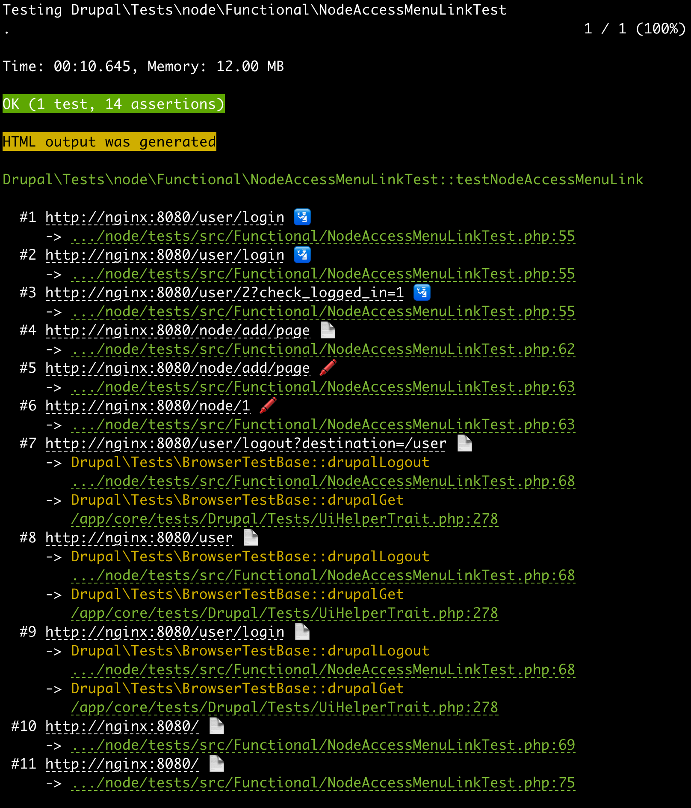
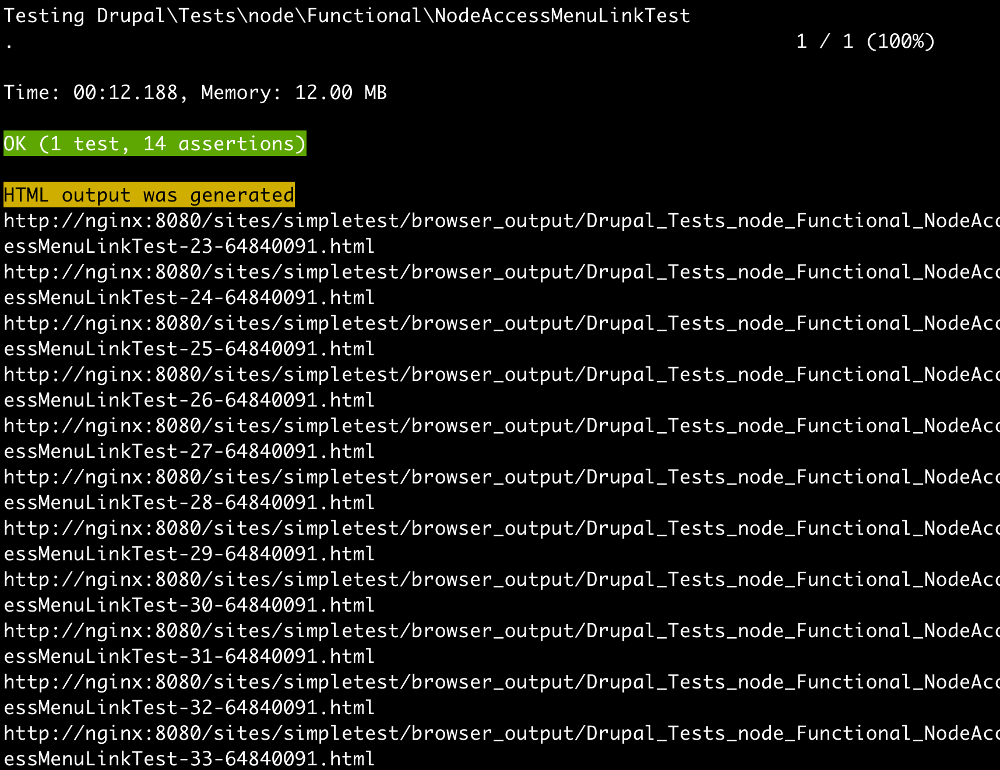
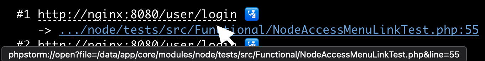
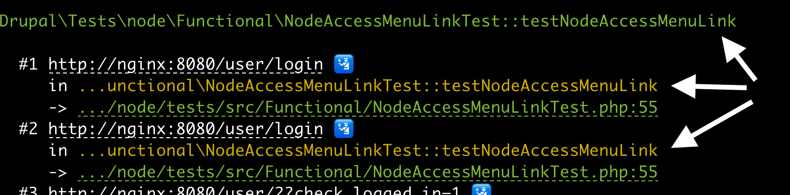
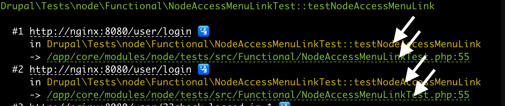

# Enhanced Drupal PHPUnit Results

[][code-coverage]
[][ci]
[](https://packagist.org/packages/dpi/enhanced-drupal-phpunit-results)

Provides tooling to improve the output of PHPUnit tests with Drupal.

**After**



**Before**



**Highlights**

 - Command-click/control click URL to open artifact in web browser.
 - Command-click/control click file+line to open in IDE (PHPStorm / VSCode / MacVim / Emacs / Sublime Text / Textmate)
 - The URL fetched is shown.
 - `drupalGet`/`drupalLogin`/`htmlOutput`/`submitForm` page loads are detected,
 - Icon shown indicating whether artifact is associated with a page load: 📄 `drupalGet` 🛂 `drupalLogin` ⚡️ `htmlOutput` 🖍 `submitForm`
 - Test method is green or red depending on test pass/failure.
 - Execution stack is shown between the test method and the point of page load.
 - For direct invocations of page load from a test, a short stack is shown.

The project is intended for use with functional tests, specifically projects
utilizing [Drupal Test Traits][dtt]. Its recommended to utilize
`phpunit --printer` or create a new `phpunit.xml` to separate Kernel and
Unit tests.

Tests will need to use the included trait. Out of the box this enhancement
cannot be used with tests out of your control, unless base test classes are
patched, such as `\Drupal\Tests\BrowserTestBase`.

_Drupal is a registered trademark of Dries Buytaert._

## Installation and setup

```shell
composer require dpi/enhanced-drupal-phpunit-results
```

In PHPUnit configuration files such as `phpunit.xml`, `phpunit.xml.dist`, etc,
modify printerClass to reference the class from this library:

```xml
<phpunit printerClass="\dpi\EnhancedDrupalPhpunitResults\EnhancedResultPrinter" />
```

In base test files, replace `use \Drupal\Tests\UiHelperTrait` with
`use \dpi\EnhancedDrupalPhpunitResults\CombinedEnhancedUiHelperTrait`.

Or if there are collisions,

```php
use EnhancedUiHelperTrait {
    EnhancedUiHelperTrait::htmlOutput insteadof UiHelperTrait;
}
```

## Configuration

Optional configuration is available.

Set these values as environment variables in the executor or phpunit.ini file.

### IDE launch links

Will trigger control/command-clicks on file paths to open in an editor of choice.

Possible values:

 - `emacs`
 - `macvim`
 - `phpstorm`
 - `sublime`
 - `textmate`
 - `vscode`

`export ENHANCED_RESULTS_IDE=phpstorm`

```xml
<php>
    <env name="ENHANCED_RESULTS_IDE" value="phpstorm" />
</php>
```



### Repeat context

Will repeat the executing test at the top of the stack. Normally the executed
test is only printed once at the beginning. This option will
print the test in context for each drupalGet at the top of the stack. This is
useful for tests with many drupalGets.

`export ENHANCED_RESULTS_USE_REPEAT_CONTEXT=TRUE`

```xml
<php>
    <env name="ENHANCED_RESULTS_USE_REPEAT_CONTEXT" value="TRUE" />
</php>
```



### Disable trimming columns to terminal width

Disable trimming file and URL text strings to terminal width. Instead strings
will display untruncated.

`export ENHANCED_RESULTS_DISABLE_TRIM_COLUMNS=TRUE`

```xml
<php>
    <env name="ENHANCED_RESULTS_DISABLE_TRIM_COLUMNS" value="TRUE" />
</php>
```



### Use sequential IDS instead of artifact numbers

Display numbers next to each drupalGet, starting from 1, relative to the current
test run. Instead of artifact numbers.

`export ENHANCED_RESULTS_USE_SEQUENTIAL_IDS=TRUE`

```xml
<php>
    <env name="ENHANCED_RESULTS_USE_SEQUENTIAL_IDS" value="TRUE" />
</php>
```

### Change file prefix

Changes file prefix so clickable files work, useful when used with Docker
mounts or symlinks.

`export ENHANCED_RESULTS_FILE_PREFIX=/home/user/www`

```xml
<php>
    <env name="ENHANCED_RESULTS_FILE_PREFIX" value="/home/user/www" />
</php>
```

# Other notes

 - Utilize Drupal's builtin `BROWSERTEST_OUTPUT_BASE_URL` if artifacts are
   accessed by a different URL by the host OS, than the test runner. This helps
   to resolve issues with incorrect clickable artifact URLs.


[ci]: https://github.com/dpi/enhanced-drupal-phpunit-results/actions
[code-coverage]: https://app.codecov.io/gh/dpi/enhanced-drupal-phpunit-results
[dtt]: https://gitlab.com/weitzman/drupal-test-traits
